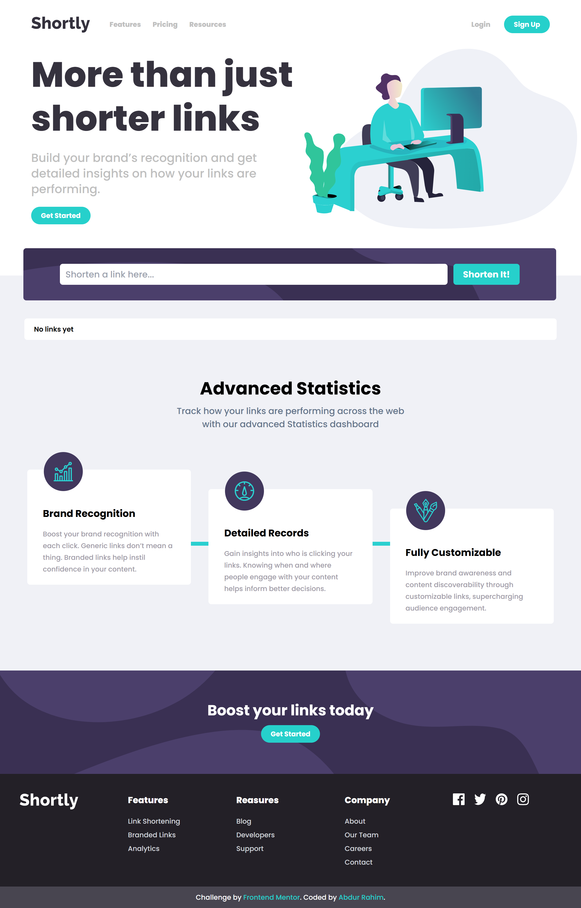

# Frontend Mentor - Shortly URL shortening API Challenge solution

This is a solution to the [Shortly URL shortening API Challenge challenge on Frontend Mentor](https://www.frontendmentor.io/challenges/url-shortening-api-landing-page-2ce3ob-G). This challenge is to build a landing page for a URL shortening API. Using react, Tailwind CSS, and the cleanuri API, I built this project. 

## Table of contents

- [Overview](#overview)
  - [The challenge](#the-challenge)
  - [Screenshot](#screenshot)
  - [Links](#links)
- [My process](#my-process)
  - [Built with](#built-with)
  - [What I learned](#what-i-learned)
  - [Continued development](#continued-development)
    - [Useful resources](#useful-resources)
- [Author](#author)
- [Acknowledgments](#acknowledgments)

## Overview

### The challenge

Users should be able to: 

- Responsive design for mobile and desktop views 
- Shorten any valid URL 
- See a list of their shortened links, even after refreshing the browser 
- Copy the shortened link to their clipboard in a single click 
- Receive an error message when the `form` is submitted if: 
  - The `input` field is empty

### Screenshot

.png)

### Links

- Solution URL: [Solution URL](https://github.com/AbdurRaahimm/URL-shortening-Landing-page.git)
- Live Site URL: [Live Site](https://url-shortener-landing.netlify.app/)

## My process

### Built with

- Semantic HTML5 markup
- Tailwind CSS
- Flexbox
- CSS Grid
- Mobile-first workflow 
- [React](https://reactjs.org/) - JS library 

### What I learned

- I learned how to use the clipboard API to copy text to the clipboard. 
- I learned API Call to the URL shortening API to get the shortened URL.
- I learned how to use Tailwind CSS to style the page.
- I learned how to use Local Storage to store the shortened URLs.

### Continued development

I want to continue to improve my skills in React and Tailwind CSS. 

#### Useful resources
- [Vite](https://vitejs.dev/) - This helped me to learn how to use Vite. 
- [React](https://reactjs.org/) - This helped me to learn how to use React. 
- [Tailwind CSS](https://tailwindcss.com/) - This helped me to learn how to use Tailwind CSS. 
- [Clipboard API](https://developer.mozilla.org/en-US/docs/Web/API/Clipboard_API) - This helped me to learn how to use the clipboard API.
- [Shortening API](https://cleanuri.com/docs) - This helped me to learn how to use the URL shortening API.

## Acknowledgments

I would like to thank Frontend Mentor for providing this challenge. It was a great learning experience.

## Author
- [Twitter](https://twitter.com/AbdurRahim4G)
- [Instagram](https://www.instagram.com/abdurrahim4g/)
- [Facebook](https://www.facebook.com/Rahim72446)
- [LinkedIn](https://www.linkedin.com/in/abdur-rahim4g/)
- [YouTube](https://youtube.com/@AbdurRahimm)

